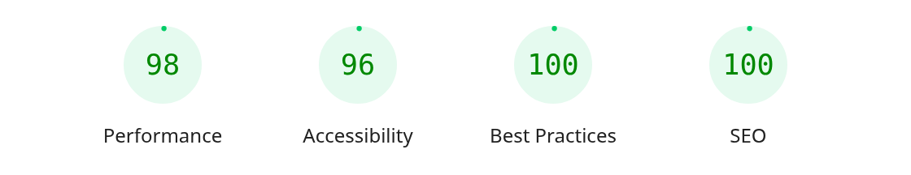

# Kodeva — Promo Akhir Tahun

Take-home test untuk posisi Fullstack Developer di PT Digital Solusi Grup. Isinya website campaign "Promo Akhir Tahun" untuk brand fiktif **Kodeva** — software kasir, HR & payroll, absensi, dan stok untuk UMKM.

Secara garis besar: landing page + blog yang kontennya bisa diedit sendiri oleh tim marketing lewat CMS, mini marketplace (katalog, keranjang, checkout), form lead capture, dan tracking event GA4.

- **Link deploy:** https://kodeva-three.vercel.app/
- **Akun CMS:** `admin@kodeva.test` / `kodeva-demo-2026`
- **Repo:** `git@github.com:mhmmdf/kodeva.git`

## Waktu pengerjaan

| | |
|---|---|
| Mulai | Kamis, 8 Oktober 2026, 19:52 WIB |
| Selesai | Sabtu, 10 Oktober 2026, 10:30 WIB |
| Durasi | Rentang 2 hari kalender, masih dalam deadline brief |

Brief memberi estimasi 6–8 jam kerja. Saya mengerjakan bertahap dengan review manual di tiap step sebelum digabung, sehingga yang lebih representatif adalah rentang kalendernya, bukan jam kerja murni.

## Cara menjalankan di lokal

Prasyarat: Node.js 20+ dan npm.

```bash
npm install
cp .env.example .env      # isi ADMIN_PASSWORD & SESSION_SECRET; DATABASE_URL kosong = pakai PGlite lokal
npm run db:setup          # migrasi + seed (kategori, artikel, konten landing, produk langsung terisi)
npm run dev               # buka http://localhost:3000
```

Mode produksi lokal:

```bash
npm run build && npm run start
```

Tersedia juga `npm run lint`, `npm run typecheck`, dan script DB: `db:generate` / `db:migrate` / `db:seed` / `db:setup`.

**Catatan operasional** (pelajaran selama pengembangan, penting supaya tidak kejadian lagi):

- Database lokal tersimpan di `.pglite/` (PGlite [Postgres in-process], jadi tidak perlu Docker). Kalau server di-kill paksa lalu query error atau halaman kosong, jalankan `rm -rf .pglite && npm run db:setup` untuk membangun ulang; data kembali seperti seed.
- Jangan menjalankan dua proses yang membuka `.pglite` bersamaan (misal `next dev` + `next build`, atau query lewat CLI saat server masih berjalan).
- Login admin menolak jika `SESSION_SECRET` kosong pada mode production (`next start`).
- Saat deploy ke Vercel: `DATABASE_URL` terisi otomatis oleh integrasi Neon dari Marketplace; tinggal tambahkan `SESSION_SECRET`, `ADMIN_EMAIL`, dan `ADMIN_PASSWORD` untuk login CMS (set di semua environment yang dipakai, termasuk Preview).
- Build Vercel otomatis menjalankan migrasi DB lewat script `prebuild` (`npm run db:migrate`) — idempoten, jadi tidak perlu migrasi manual tiap deploy. Seed cukup sekali (`npm run db:setup`) terhadap database production.

## Arsitektur dan alasan pemilihan stack

| Bagian | Pilihan | Alasan |
|---|---|---|
| Framework | **Next.js 16 (App Router) + TypeScript** | TypeScript wajib sesuai brief. App Router memisahkan halaman publik `(public)` dan admin `(panel)` dengan rapi. Partial Prerender membuat landing/blog terprerender (cepat dibuka di HP) sambil menyisipkan konten dari DB |
| Revalidation | `updateTag()` + cache tag per koleksi | Perubahan konten yang dipublish dari CMS langsung tampil tanpa deploy ulang — ini syarat brief. Konsekuensinya dicatat di bagian asumsi |
| CMS | **Dibangun sendiri** (admin dari nol), bukan Strapi/Sanity/WordPress | Kebutuhannya hanya 5 koleksi konten. Satu codebase, satu deploy, tanpa service tambahan, dan revalidation bisa langsung diikat ke tag Next.js. Brief sendiri membolehkan CMS apa pun asal dijelaskan |
| Database | **Drizzle ORM** — Neon (Postgres serverless) di produksi, **PGlite** di lokal | Hanya dibedakan lewat satu variabel `DATABASE_URL`. Lokal jalan tanpa Docker/kartu kredit, produksi memakai Neon gratis dari Vercel Marketplace. Migrasi dan seed memakai skema yang sama |
| State keranjang | **Zustand + persist (localStorage)** | Ringan, tanpa boilerplate, sesuai kebutuhan keranjang front-end. Hydrasi diatur manual agar tidak ada hydration mismatch |
| Validasi | **Zod** | Satu skema dipakai di server action (lead, artikel, kategori, landing) sekaligus di client |
| Session admin | **jose** (JWT HS256 di cookie httpOnly) | Ringan, tanpa dependensi berat. Login diberi rate-limit in-process |
| Styling | **Tailwind CSS 4** + plugin typography (untuk blog) | Praktis untuk iterasi cepat. Tanpa library UI — layout ditulis sesuai kebutuhan |
| Isi artikel | **Markdown** (disimpan di DB, dirender dengan renderer ringan) | Memenuhi requirement isi rich text tanpa editor WYSIWYG berat, dan mudah di-sanitize |

Library/boilerplate yang dipakai sesuai brief poin 9: **Zustand** (state keranjang), **jose** (JWT), **drizzle-orm** (ORM), **Zod** (validasi), **Vitest + Playwright** (pengujian). Template website atau starter kit tidak dipakai — proyek dimulai dari `create-next-app` dan desain ditulis sendiri.

## Asumsi atas hal yang ambigu di brief

1. **Bagian B cukup front-end** (brief eksplisit): checkout disimulasikan lokal — form pembeli divalidasi, pembayaran disimulasikan, order mock disimpan di `localStorage` beserta UTM-nya. Belum ada transaksi sungguhan. Karena brief meminta status sukses **dan** gagal, hasil simulasi sengaja dipilih eksplisit lewat radio di form checkout (default sukses) — jadi penilai bisa menguji kedua alur tanpa harus menebak-nebak aturan.
2. **Data dummy:** katalog dari `data/products.json`, konten CMS dari seed (`npm run db:seed`). Tidak ada data pribadi atau API key sungguhan di repository.
3. **UTM first-touch:** UTM dari link Instagram/TikTok disimpan di `localStorage` saat pertama kali terlihat, sehingga bertahan saat user berpindah halaman sebelum mengisi form atau checkout. UTM disertakan pada data lead **dan** payload order mock.
4. **Tracking tanpa akun GA sungguhan** (brief: "cukup buktikan event terkirim"): event dikirim ke `window.dataLayer` berformat GA4 (`view_item`, `add_to_cart`, `begin_checkout`, klik CTA → `select_content`). Penilai tinggal menyambungkan ke GTM/GA4.
5. **Blog:** pagination 5 artikel per halaman. Artikel berstatus `draft` tidak tampil di situs publik.
6. **Bahasa:** route/URL memakai English (`/products`, `/cart`, `/admin/posts`), tampilan dan isi situs bahasa Indonesia sesuai pasar campaign.
7. **Kuota promo** dihitung dari total lisensi satu produk di dalam keranjang (sesuai brief), batasnya = sisa kuota di katalog.
8. **Bug yang diketahui (Next 16.4.0):** route slug invalid yang memanggil `notFound()` in-page di PPR bisa membalas body 404 dengan status 200 pada request pertama (request berikutnya normal 404). Sudah dicek ke upstream (issue #95380/#95561); versi stabil saat tes ini belum memiliki perbaikannya.

## Status pengerjaan

Seluruh requirement wajib sudah selesai:

- **Bagian A — Landing + CMS:** hero, produk unggulan, testimoni, dan FAQ bisa diedit dari CMS tanpa deploy (revalidasi tag). Form lead tervalidasi dan dilindungi anti-spam (honeypot, time-trap, rate-limit), datanya tampil di halaman admin lengkap dengan UTM-nya. Blog memiliki daftar + pagination + halaman detail slug. Artikel dikelola lewat CMS: judul, slug, cover, isi markdown, kategori, status draft/publish, dan bisa menautkan produk.
- **Bagian B — Marketplace:** katalog 7 produk dengan filter kategori. Halaman detail menampilkan screenshot fitur, harga coret, sisa kuota, dan pilihan paket yang langsung mengubah harga. Keranjang mendukung tambah, ubah jumlah, hapus, subtotal otomatis, dan isi tetap ada saat refresh. Batas kuota dihitung dari total lisensi satu produk (bukan per baris) — baik di panel pembelian, di keranjang, maupun di store-nya, sehingga paket Basic + Pro dari produk yang sama tidak bisa melampaui sisa kuota. Checkout memiliki validasi form, pilihan hasil simulasi pembayaran (sukses/gagal), ringkasan pesanan di halaman sukses maupun gagal; saat gagal keranjang tetap tersimpan untuk dicoba lagi. Status loading, kosong, dan error ditangani. Nyaman di HP: navbar hamburger dan ikon keranjang ber-badge.
- **Bagian C — Marketing:** Lighthouse mobile Performance **98** (target ≥ 80). Event `view_item`, `add_to_cart`, `begin_checkout`, dan klik CTA landing dikirim ke `dataLayer` berformat GA4, tidak terkirim berulang hanya karena component re-render, dan payload-nya membawa info produk + campaign + UTM. UTM bertahan antar halaman serta terikut ke data lead dan payload order mock.

## Yang belum dikerjakan

Semuanya bonus/opsional dari brief, jadi sengaja diprioritaskan belakangan:

- Urutan/visibility section landing dari CMS, pencarian & urutan katalog yang tercermin di URL, tabel bandingkan paket, durasi langganan, penjadwalan promo, voucher, preview draft.
- Test otomatis: Vitest sudah terpasang, tetapi test unit belum ditulis.

## Rencana kalau diberi waktu 1 minggu lagi

1. Test unit untuk logika krusial: batas kuota lintas paket, perhitungan subtotal/diskon, rate-limit & honeypot lead, UTM first-touch.
2. Bonus brief: filter/urutan/pencarian produk di URL, voucher dengan aturan sederhana, urutan section landing dari CMS.
3. Optimasi Lighthouse lebih lanjut (unused JavaScript ± 300 ms) dan penyelesaian audit aksesibilitas (96 → 100).
4. Riwayat beberapa order simulasi terakhir di `localStorage` (bukan cuma satu), plus halaman sukses yang bisa dipakai ulang untuk cek status saat backend sudah tersambung.

## Rencana menghubungkan marketplace ke backend

Saat ini seluruh alur masih simulasi di front-end. Saat backend diaktifkan, gambarannya seperti berikut.

**Endpoint yang dibutuhkan**

| Endpoint | Fungsi |
|---|---|
| `POST /api/orders` | Menerima ringkasan order (items, paket, qty, data pembeli, UTM) → validasi ulang harga & kuota **di server** → reservasi kuota → membuat order `pending` → mengembalikan `order_id` + URL pembayaran (midtrans/Xendit/sandbox) |
| `GET /api/orders/:id` | Status order untuk polling di halaman sukses |
| `GET /api/orders?email=` | Riwayat order (opsional, untuk reseller) |
| `POST /api/webhooks/payment` | Menerima notifikasi payment gateway |
| `GET /api/licenses?order_id=` | Daftar lisensi setelah pembayaran |

**Alur pembayaran yang aman**

1. Client hanya mengirim *identitas* item (slug, package_id, qty). Harga dan total dihitung ulang di server dari katalog — tidak pernah dipercaya dari client.
2. Server membuat order `pending` beserta reservasi kuota lisensi (berlaku sementara, misal 30 menit).
3. User membayar di halaman gateway; status berubah **hanya** lewat webhook.
4. Webhook diverifikasi: cek signature/HMAC dari gateway, cocokkan `order_id` + jumlah, dan pakai **idempotency** berdasarkan `event_id` (notifikasi boleh dikirim berulang).
5. State machine order: `pending → awaiting_payment → paid | failed | expired`. Transisi hanya boleh maju sesuai aturan (misal `paid` tidak bisa kembali ke `pending`). Setelah `expired`, reservasi kuota dilepas.

**Menjaga kuota lisensi promo tetap akurat**

- Kolom `promo_remaining` diupdate **atomik**: `UPDATE ... SET promo_remaining = promo_remaining - $n WHERE id = $id AND promo_remaining >= $n`, sehingga tidak bisa oversel walau banyak pembeli bersamaan.
- Reservasi dibuat saat order `pending`, dikunci saat `paid`, dan dilepas saat `expired/failed`. Kuota tidak "hilang" oleh pembeli yang batal.
- Alternatifnya: tabel `license_reservations` per order plus job pembersih untuk yang lewat waktu.

**Pengiriman lisensi setelah pembayaran berhasil**

1. Webhook `paid` → transaksi DB: mengunci pembayaran dan generate `license_keys` (random, unik, terikat paket dan jumlah lisensi).
2. Mengirim email resi + kunci lisensi (Resend/SES) dan menampilkannya di halaman sukses, termasuk link unduh invoice.
3. Idempoten: retry webhook tidak menghasilkan email/kunci ganda (dicek dari transisi status).

## Lighthouse mobile — landing page

Diukur pada `http://localhost:3100/` (production build, mode mobile, Chrome headless):



Metrik: FCP 0,8 s · LCP 2,3 s · TBT 30 ms · CLS 0.

(Catatan: skor Lighthouse bisa bergerak 1–2 poin antar run di mesin lokal; angka di atas adalah run terakhir setelah finalisasi kode.)

## Struktur folder

```
app/
  (public)/            # landing, blog, products, cart (terprerender + konten DB)
  admin/               # CMS: login, (panel)/{dashboard, posts, landing, leads}
  actions/             # server action publik (lead)
components/
  landing/ site/       # section landing & header situs
  blog/ marketplace/   # kartu artikel, keranjang, panel pembelian
  admin/ tracking/     # form CMS, komponen tracking GA4
lib/
  content/             # reader konten landing & blog (cache + tag)
  db/                  # client hybrid Neon/PGlite + schema Drizzle
  marketplace/         # katalog & store keranjang (Zustand)
  tracking/            # dataLayer + UTM
data/                  # products.json, markdown artikel
drizzle/ scripts/      # migrasi & seed
docs/                  # brief PDF + screenshot Lighthouse
```
